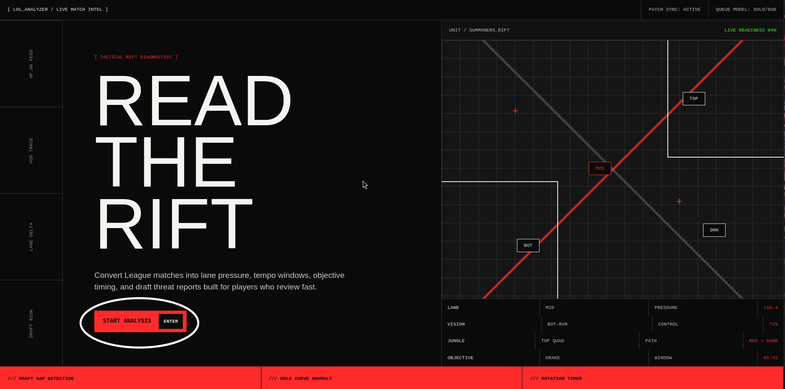
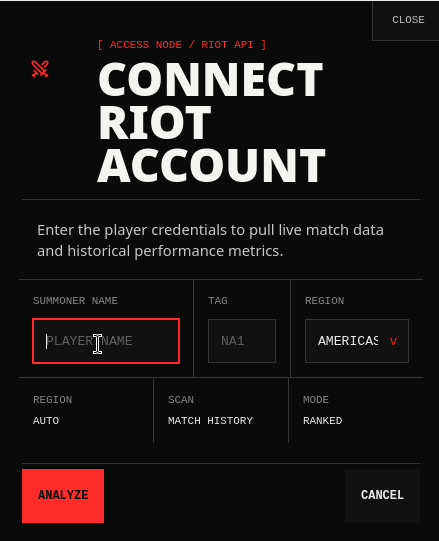

<a id="readme-top"></a>

<!-- PROJECT SHIELDS -->

[![Contributors][contributors-shield]][contributors-url]
[![Forks][forks-shield]][forks-url]
[![Stargazers][stars-shield]][stars-url]
[![Issues][issues-shield]][issues-url]
[![project_license][license-shield]][license-url]
[![LinkedIn][linkedin-shield]][linkedin-url]


<!-- PROJECT LOGO -->
<br />
<div align="center">
  <a href="https://github.com/srivp365/lol_analyzer">
    
  </a>

<h3 align="center">League of Legends Analyzer</h3>

  <p align="center">
    project_description
    <br />
    <a href="https://github.com/srivp365/lol_analyzer"><strong>Explore the docs »</strong></a>
    <br />
    <br />
    <a href="https://github.com/srivp365/lol_analyzer">View Demo</a>
    &middot;
    <a href="https://github.com/srivp365/lol_analyzer/issues/new?labels=bug&template=bug-report---.md">Report Bug</a>
    &middot;
    <a href="https://github.com/srivp365/lol_analyzer/issues/new?labels=enhancement&template=feature-request---.md">Request Feature</a>
  </p>
</div>


<!-- TABLE OF CONTENTS -->
<details>
  <summary>Table of Contents</summary>
  <ol>
    <li>
      <a href="#about-the-project">About The Project</a>
      <ul>
        <li><a href="#built-with">Built With</a></li>
      </ul>
    </li>
    <li>
      <a href="#getting-started">Getting Started</a>
      <ul>
        <li><a href="#prerequisites">Prerequisites</a></li>
        <li><a href="#installation">Installation</a></li>
      </ul>
    </li>
    <li><a href="#usage">Usage</a></li>
    <li><a href="#roadmap">Roadmap</a></li>
    <li><a href="#contributing">Contributing</a></li>
    <li><a href="#license">License</a></li>
    <li><a href="#contact">Contact</a></li>
    <li><a href="#acknowledgments">Acknowledgments</a></li>
  </ol>
</details>


<!-- ABOUT THE PROJECT -->
## About The Project

[![Product Name Screen Shot][product-screenshot]](https://example.com)

A small app I developed for users to be able to review their League of Legends statistics, things like CreepScore /min, Lane phase diff, Gold difference between you and your direct opposition alongside other statistics provided by the Riot API. The hope is for players to be able to have a more active understanding of where they're falling behind the competition (I'm not collecting enough gold, not killing enough creeps, dying more often than securing kills) and be able to pay more attention to this during future games!

<p align="right">(<a href="#readme-top">back to top</a>)</p>


### Built With

* [![React][React.js]][React-url]
* [![Python][Python]][Python-url]
* [![FastAPI][FastAPI]][FastAPI-url]
* [![Postgres][Postgres]][Postgres-url]
* [![uv][uv]][uv-url]
* [![docker][docker]][docker-url]

<p align="right">(<a href="#readme-top">back to top</a>)</p>


<!-- GETTING STARTED -->
## Getting Started

### Prerequisites

To run this program locally, you're going to need **Python 3.10**, **Node.js 18+**, **Docker** and **uv** installed. 

### Installation

1. Get a free API Key at the [Riot Games Developer Portal](https://developer.riotgames.com/)
2. Clone the repo
   ```sh
   git clone https://github.com/srivp365/lol_analyzer.git
   ```
3. Spin up the database docker container
   ```sh
   docker-compose up -d db  
   ```
4. Setup the backend server
  ```bash
  cd backend
  uv sync
  source .venv/bin/activate  # On Windows use: .venv\Scripts\activate

  # Run Alembic migrations to build the schema
  alembic upgrade head
  ```


5. Enter your API Key in a .env file in the backend/ directory (find_env() will find it)
   ```sh
   RIOT_API_KEY=your_development_key_here
   ```
6. Start the backend server
  ```sh
  uv run app/main.py
  ```
5. Start the react app
   ```sh
    cd frontend
    npm install
    npm run dev

   ```

<p align="right">(<a href="#readme-top">back to top</a>)</p>


<!-- USAGE EXAMPLES -->
## Usage


Click on the start analysis button to start.


Enter the summoner name, tag and region.

<p align="right">(<a href="#readme-top">back to top</a>)</p>


<!-- ROADMAP -->
## Roadmap

- [ ] XGBoost algorithm to predict how upcoming matches will go
- [ ] Uncover more patterns (potentially implementing an unsupervised learning model) from match data to provide deeper and overlooked insights.
- [ ] Implement an algorithm that takes the insights produced by the previous ML model, and produce human readable output based on feature weight.

See the [open issues](https://github.com/srivp365/lol_analyzer/issues) for a full list of proposed features (and known issues). 

<p align="right">(<a href="#readme-top">back to top</a>)</p>


<!-- CONTRIBUTING -->
## Contributing

As a first-year engineering student, I built this project as a means of bettering my full stack skills, while also learning more about Docker, OCI and sql-alchemy.
If you see an area for optimization, have deployment advice, or just want to discuss the code, please feel free to open an Issue or start a Discussion.

1. Fork the Project
2. Create your Feature Branch (`git checkout -b feature/AmazingFeature`)
3. Commit your Changes (`git commit -m 'Add some AmazingFeature'`)
4. Push to the Branch (`git push origin feature/AmazingFeature`)
5. Open a Pull Request

<p align="right">(<a href="#readme-top">back to top</a>)</p>

### Top contributors:

<a href="https://github.com/srivp365/lol_analyzer/graphs/contributors">
  
</a>


<!-- CONTACT -->
## Contact

Srivathsan Prasanna - srivdev365@gmail.com

Project Link: [https://github.com/srivp365/lol_analyzer](https://github.com/srivp365/lol_analyzer)

<p align="right">(<a href="#readme-top">back to top</a>)</p>


<!-- ACKNOWLEDGMENTS -->
## Acknowledgments

* None as of yet!

<p align="right">(<a href="#readme-top">back to top</a>)</p>


<!-- MARKDOWN LINKS & IMAGES -->
<!-- https://www.markdownguide.org/basic-syntax/#reference-style-links -->
[contributors-shield]: https://img.shields.io/github/contributors/srivp365/lol_analyzer.svg?style=for-the-badge
[contributors-url]: https://github.com/srivp365/lol_analyzer/graphs/contributors
[forks-shield]: https://img.shields.io/github/forks/srivp365/lol_analyzer.svg?style=for-the-badge
[forks-url]: https://github.com/srivp365/lol_analyzer/network/members
[stars-shield]: https://img.shields.io/github/stars/srivp365/lol_analyzer.svg?style=for-the-badge
[stars-url]: https://github.com/srivp365/lol_analyzer/stargazers
[issues-shield]: https://img.shields.io/github/issues/srivp365/lol_analyzer.svg?style=for-the-badge
[issues-url]: https://github.com/srivp365/lol_analyzer/issues
[license-shield]: https://img.shields.io/github/license/srivp365/lol_analyzer.svg?style=for-the-badge
[license-url]: https://github.com/srivp365/lol_analyzer/blob/master/LICENSE.txt
[linkedin-shield]: https://img.shields.io/badge/-LinkedIn-black.svg?style=for-the-badge&logo=linkedin&colorB=555
[linkedin-url]: https://linkedin.com/in/srivp
[product-screenshot]: images/screenshot.png

<!-- Shields.io badges. You can a comprehensive list with many more badges at: https://github.com/inttter/md-badges -->
[React.js]: https://img.shields.io/badge/React-%2320232a.svg?logo=react&logoColor=%2361DAFB
[React-url]: https://reactjs.org/
[FastAPI]: https://img.shields.io/badge/FastAPI-009485.svg?logo=fastapi&logoColor=white
[FastAPI-url]: https://fastapi.tiangolo.com/
[Postgres]: https://img.shields.io/badge/Postgres-%23316192.svg?logo=postgresql&logoColor=white
[Postgres-url]: https://www.postgresql.org/
[Python]: https://img.shields.io/badge/Python-3776AB?logo=python&logoColor=fff
[Python-url]: https://www.python.org/
[Docker]: https://img.shields.io/badge/Docker-2496ED?logo=docker&logoColor=fff
[Docker-url]: https://www.docker.com/
[uv]: https://img.shields.io/badge/uv-261230.svg?logo=uv&logoColor=#de5fe9
[uv-url]: https://docs.astral.sh/uv/
